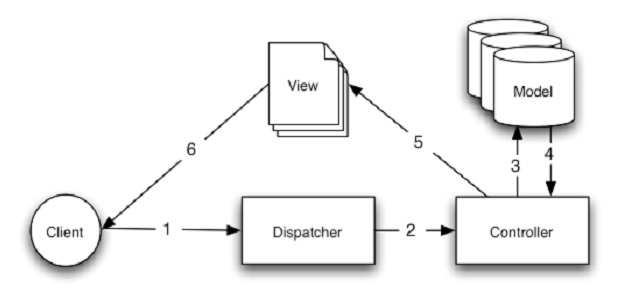

# Seminário-DAW

<p align="center">
  
</p>

## Índice

* [Introdução](#introdução)
* [Instalação e configuração](#instalação-e-configuração)
* [Primeiros Passos](#primeiros-passos)
* [Ferramentas Similares](#ferramentas-similares)

---

## Introdução


O grupo já apresentado tratará sobre a plataforma CakePHP. 

O CakePHP é um framework de PHP que é usado para o desenvolvimento de aplicações web. 
Ele possui uma estrutura extensível para o desenvolvimento, a manutenção e a implantação de aplicativos.

O objetivo dessa ferramenta é simplificar o processo de desenvolvimento para a construção de aplicações web, 
a partir de um núcleo geral para organizar o banco de dados e outros recursos que ajudam a reduzir a codificação.

Além disso, o CakePHP possui recursos importantes como validação embutida, listas de controle de acesso (ACLs), sanitização de dados, segurança e componentes de manipulação de sessão e cache de view. 

É uma ferramenta bastante escolhida pelos desenvolvedores webs por ser baseado no padrão de desenvolvimento Model-View-Controller, que separa a lógica da aplicação de sua apresentação para o usuário, ou seja, essa arquitetura nos permite construir aplicações web com o mínimo de script uma vez que a apresentação é separada do código. 
Um exemplo disso é quando desejamos modificar todo o layout de páginas sem mudar o restante da aplicação. 

A arquitetura MVC no CakePHP é representada assim:

<p align="center">
  
</p>
  


 Imagine que você é um mero mortal e não sabe programar em PHP. Caso vocẽ não tenha um bom professor como a turma 303 do ano de 2022 do Colégio Técnico da UFMG acaba se tornando complicado. Ou até mesmo caso você não tenha tempo o suficiente ou o interesse necessário para aprender você pode usar o CakePHP para isso! 
 
É possível criar blogs pessoais e muito mais! Essa é uma plataforma de criação de aplicações web, no qual o principal objetivo é permitir que você trabalhe em uma estrutura que possa programar de forma rápida e sem a perda de flexibilidade.
  

Caso você queira criar um blog é simples, rápido e fácil.

**Criando um blog com CakePHP**

Básico:
- Você precisará de um servidor web em funcionamento, um servidor de banco de dados e por último um conhecimento básico sobre PHP(é possível adiquir em pouquíssimo tempo com aulas gratuitas);
- Primeiro é necessário a instalação e configuração do Cake.php (está no próximo tópico);
- Logo após será preciso que se crie um banco de dados para gerenciar as postagens do seu blog.;
- Com o banco de dados criados é feita a criação da tabela;
- Configure em seguida o seu banco de dados;
- Cria-se o model;
- Cria-se o controller;
- Cria-se as as views;
- Adiciona-se e valida-se os artigos;
- Pode-se também editá-los e deletá-los.

Com o mais avançado você pode:
- Criar uma arvore de Categoria;
- Aprender a Migração de Plugin;
- Modificar as Tabelas;
- Gerar código esqueleto por categorias;
- Anexar árvore de compartamento para CategoriesTable;
- Reordenar categorias com TreeBahavior;
- Modificar o ArticlesController;
- Modificar os artigos Templatesr.

Autenticação e Autorização do seu blog:
- Cria-se todo o código relacionado ao Usuário;
- Autenticar com login e logout;
- Autorizar as pessoas permitidas.


---

## Instalação e configuração

O CakePHP é rápido e fácil de instalar. Os requisitos mínimos são um servidor web e uma cópia do Cake, só isso!

### Requisitos 

- HTTP Server;
- PHP 7.4 ou superior;

Tecnicamente não é exigido um banco de dados mas imaginamos que a maioria das aplicações irá utilizar um. O CakePHP suporta uma variedade deles:

- MySQL (4 ou superior);
- PostgreSQL;
- Microsoft SQL Server;
- SQLite.

### Licença

O CakePHP é licenciado sob uma Licença MIT. Isto significa que você tem liberdade para modificar, distribuir e republicar o código-fonte com a condição de que os avisos de copyright permaneçam intactos. Você também tem liberdade para incorporar o CakePHP em qualquer aplicação comercial ou de código fechado.


### Baixando...

Há duas maneiras de se obter uma cópia atualizada do CakePHP. Você pode fazer o download de um arquivo comprimido (zip/tar.gz/tar.bz2) no site principal ou obter o código a partir do repositório git.

### Permissões

O CakePHP utiliza o diretório tmp para diversas operações. Você pode executar somente uma vez os seguintes comandos a partir do diretório da
sua aplicação para assegurar que as permissões serão configuradas corretamente

```
"HTTPDUSER=`ps aux | grep -E '[a]pache|[h]ttpd|[_]www|[w]ww-data|[n]ginx' | grep -v root␣
˓→| head -1 | cut -d\ -f1`
setfacl -R -m u:${HTTPDUSER}:rwx tmp
setfacl -R -d -m u:${HTTPDUSER}:rwx tmp
setfacl -R -m u:${HTTPDUSER}:rwx logs
setfacl -R -d -m u:${HTTPDUSER}:rwx logs"
```
---

## Configuração

É possível usar três maneiras diferentes: 

### Desenvolvimento

Descompacte o conteúdo do arquivo do Cake em /var/www/html. Você agora tem uma pasta na raiz do seu servidor web com o nome da versão que você baixou (por exemplo, cake2.0.0). Renomeie essa pasta para cake_2_0. Sua configuração de desenvolvimento será semelhante a esta em seu sistema de arquivos:

```
/var/www/html/
cake_2_0/
app/
lib/
plugins/
vendors/
.htaccess
index.php
README
```

Se o seu servidor web está configurado corretamente, agora você deve encontrar sua aplicação Cake acessível em http://www.example.com/cake_2_0/.

**Utilizando um pacote CakePHP para múltiplas Aplicações**

Para começar, clone o CakePHP em um diretório. 

Para esse exemplo, nós vamos utilizar /home/mark/projects: "git clone git://github.com/cakephp/cakephp.git /home/mark/projects/cakephp". 

Isso ira clonar o CakePHP no seu diretório /home/mark/projects. Se você não quiser utilizar git, você pode baixar um compilado e os próximos passos serão os mesmos.

Em seguida você terá que localizar e modificar seu php.ini. Em sistemas nix está localizado na maioria das vezes em /etc/php.ini, mas utilizando php -i e procurando por ‘Loaded Configuration File’, você pode achar a localização atual.

Uma vez que você achou o arquivo ini correto, modifique a configuração include_path para incluir /home/mark/projects/cakephp/lib. Um exemplo semelhamte deveria ser como "include_path = .:/home/mark/projects/cakephp/lib:/usr/local/php/lib/php". 

Depois de reiniciar seu servidor web, você deve ver as mudanças refletidas em phpinfo().

### Produção

Descompacte o conteúdo do arquivo do Cake em um diretório de sua escolha. Para fins deste exemplo, assumimos que você escolheu instalar o Cake em/cake_install. Sua configuração de produção será semelhante a esta em seu sistema de arquivos:

```
/cake_install/
app/
webroot/ (esse diretório está definido como diretiva ``DocumentRoot``)
lib/
plugins/
vendors/
.htaccess
index.php
README
```

Desenvolvedores usando o Apache devem definir o DocumentRoot do domínio para: "DocumentRoot /cake_install/app/webroot" Se o seu servidor web estiver configurado corretamente, você deve encontrar agora sua aplicação Cake acessível em http://www.example.com.

### Instalação Avançada e Configuração Específica por Servidor

**Instalação Avançada**

Pode haver algumas situações onde você deseja colocar os diretórios do CakePHP em diferentes locais no sistema de arquivos. Isto pode ser devido a uma restrição do servidor compartilhado, ou talvez você queira apenas que algumas aplicações compartilhem as bibliotecas do Cake.

Em primeiro lugar, note que há três partes principais de uma aplicação CakePHP.

1. As bibliotecas do núcleo do CakePHP, em /cake.
2. O código da sua aplicação, em /app.
3. Os arquivos públicos da sua aplicação, normalmente em /app/webroot.

Cada um desses diretórios podem ser localizados em qualquer em seu sistema de arquivos, com exceção do webroot, que precisa ser acessível pelo seu servidor web. Você pode até mesmo mover a pasta webroot para fora da pasta app, desde que você diga ao Cake onde você colocou. Para configurar sua instalação do Cake, você precisa fazer algumas modificações nos seguintes arquivos.

- /app/webroot/index.php
- /app/webroot/test.php

Há três constantes que você precisa editar: ROOT, APP_DIR, e CAKE_CORE_INCLUDE_PATH.

- ROOT deve ser configurada para o diretório que contém sua pasta app.
- APP_DIR deve ser definida como o nome de sua pasta app.
- CAKE_CORE_INCLUDE_PATH deve ser definida como o caminho da sua pasta de bibliotecas do CakePHP.

Dado este tipo de configuração, eu preciso editar meu arquivo webroot/index.php (que vai acabar em /var/www/mysite/index.php, neste exemplo) para algo como o seguinte:

```
// /app/webroot/index.php (parcial, comentários removidos)
if (!defined('ROOT')) {
define('ROOT', DS . 'home' . DS . 'me');
}
if (!defined('APP_DIR')) {
define ('APP_DIR', 'myapp');
}
if (!defined('CAKE_CORE_INCLUDE_PATH')) {
define('CAKE_CORE_INCLUDE_PATH', DS . 'usr' . DS . 'lib');
}
```

Recomenda-se a utilização da constante DS ao invés das barras para delimitar os caminhos de arquivos.

**Apache e mod_rewrite (e .htaccess)**

Aqui estão algumas coisas que você pode tentar fazer para rodar corretamente. Primeiro veja o seu httpd.conf.

1. Tenha certeza que a sobreposição do .htaccess está sendo permitida, ou seja, que o AllowOverride está configurado como All para o DocumentRoot. Você deve ver algo similar a isso:

```
# Cada diretório com o Apache tenha acesso pode ser configurado com
# relação aos quais serviços e recursos são permitidos e/ou
# desabilitados neste diretório (e seus subdiretórios).
#
# Primeiro, configuramos o o "padrão" para ter um conjunto muito
# restrito de recursos.
#
<Directory />
Options FollowSymLinks
AllowOverride All
# Order deny,allow
# Deny from all
</Directory>
```

2. Tenha certeza de estar carregando o mod_rewrite corretamente. Você deve ver algo como: "LoadModule rewrite_module libexec/apache2/mod_rewrite.so".

Depois de fazer as alterações, reinicie o Apache para ter certeza que as configurações estão aivas. Verifique se os seus arquivos .htaccess estão nos diretórios corretos.

3. Tenha certeza que sua cópia do CakePHP é veio da seção de downloads do nosso site ou do nosso repositório GIT, e foi descompactada corretamente verificando os seus arquivos .htaccess.

No diretório raiz do Cake (precisa ser copiado para o seu DocumentRoot, este redireciona tudo para a sua aplicação):

```
<IfModule mod_rewrite.c>
RewriteEngine on
RewriteRule ^$ app/webroot/ [L]
RewriteRule (.*) app/webroot/$1 [L]
</IfModule>
```

O diretório app do seu Cake (será copiado para o diretório principal da sua aplicação pelo bake):

```
<IfModule mod_rewrite.c>
RewriteEngine on
RewriteRule ^$ webroot/ [L]
RewriteRule (.*) webroot/$1 [L]
</IfModule>
```

Diretório webroot do Cake (será copiado para a raiz da sua aplicação web pelo bake):

```
<IfModule mod_rewrite.c>
RewriteEngine On
RewriteCond %{REQUEST_FILENAME} !-d
RewriteCond %{REQUEST_FILENAME} !-f
RewriteRule ^(.*)$ index.php [QSA,L]
</IfModule>
```
**URLs amigáveis e Lighttpd**

Usando o mod_rewrite O modo mais fácil para se obter URLs amigáveis é adicionando este script na configuração do seu lighty. Basta editar a URL, e tudo deve funcionar. Por favor, note que isto não funciona em instalações do Cake em subdiretórios.

```
$HTTP["host"] =~ "^(www\.)?example.com$" {
url.rewrite-once = (
# if the request is for css|files etc, do not pass on to Cake
"^/(css|files|img|js)/(.*)" => "/$1/$2",
"^([^\?]*)(\?(.+))?$" => "/index.php?url=$1&$3",
)
evhost.path-pattern = "/home/%2-%1/www/www/%4/app/webroot/"
}
```

Usando o mod_magnet Para utiizar URLs amigáveis com o CakePHP e o Lighttpd, coloque este script LUA em
```
/etc/lighttpd/cake.
-- little helper function
function file_exists(path)
local attr = lighty.stat(path)
if (attr) then
return true
else
return false
end
end
function removePrefix(str, prefix)
return str:sub(1,#prefix+1) == prefix.."/" and str:sub(#prefix+2)
end
-- prefix without the trailing slash
local prefix = ''
-- the magic ;)
if (not file_exists(lighty.env["physical.path"])) then
-- file still missing. pass it to the fastcgi backend
request_uri = removePrefix(lighty.env["uri.path"], prefix)
if request_uri then
lighty.env["uri.path"] = prefix .. "/index.php"
local uriquery = lighty.env["uri.query"] or ""
lighty.env["uri.query"] = uriquery .. (uriquery ~= "" and "&" or "") .. "url=" ..␣
˓→request_uri
lighty.env["physical.rel-path"] = lighty.env["uri.path"]
lighty.env["request.orig-uri"] = lighty.env["request.uri"]
lighty.env["physical.path"] = lighty.env["physical.doc-root"] .. lighty.env[
˓→"physical.rel-path"]
end
end
-- fallthrough will put it back into the lighty request loop
-- that means we get the 304 handling for free. ;)

```
```
$HTTP["host"] =~ "example.com" {
server.error-handler-404 = "/index.php"
magnet.attract-physical-path-to = ( "/etc/lighttpd/cake.lua" )
server.document-root = "/var/www/cake-1.2/app/webroot/"
# Think about getting vim tmp files out of the way too
url.access-deny = (
"~", ".inc", ".sh", "sql", ".sql", ".tpl.php",
".xtmpl", "Entries", "Repository", "Root",
".ctp", "empty"
)
}
```

**URLs amigáveis no nginx**

nginx é um servidor popular que, como Lighttpd, usa menos recursos do sistema. O inconveniente é que não faz uso de arquivos .htaccess como o Apache e o Lighttpd, por isso é necessário criar as URLs reescritas na configuração site-available.

```
server {
listen 80;
server_name www.example.com;
rewrite ^(.*) http://example.com$1 permanent;
}
server {
listen 80;
server_name example.com;
# root directive should be global
root /var/www/example.com/public/app/webroot/;
index index.php;
access_log /var/www/example.com/log/access.log;
error_log /var/www/example.com/log/error.log;
location / {
try_files $uri $uri/ /index.php?$uri&$args;
}
location ~ \.php$ {
include /etc/nginx/fastcgi_params;
try_files $uri =404;
fastcgi_pass 127.0.0.1:9000;
fastcgi_index index.php;
fastcgi_param SCRIPT_FILENAME $document_root$fastcgi_script_name;
}
}
```

**URL Rewrites no IIS7 (Windows hosts)**

O IIS7 não suporta nativamente os arquivos .htaccess.

1. Use o Microsift Web Plataform Installer para instalar o URL Rewrite Module 2.0.
2. Crie um novo arquivo dentro de sua pasta do CakePHP, chamado web.config.
3. Usando o Notepad ou algum outro editor de XML, copie o seguinte código no seu novo arquivo web.config. . .

```
<?xml version="1.0" encoding="UTF-8"?>
<configuration>
<system.webServer>
<rewrite>
<rules>
<rule name="Imported Rule 1" stopProcessing="true">
<match url="^(.*)$" ignoreCase="false" />
<conditions logicalGrouping="MatchAll">
<add input="{REQUEST_FILENAME}" matchType="IsDirectory" negate=
˓→"true" />
<add input="{REQUEST_FILENAME}" matchType="IsFile" negate="true"␣
˓→/>
</conditions>
<action type="Rewrite" url="index.php?url={R:1}" appendQueryString="true" />
</rule>
<rule name="Imported Rule 2" stopProcessing="true">
<match url="^$" ignoreCase="false" />
<action type="Rewrite" url="/" />
</rule>
<rule name="Imported Rule 3" stopProcessing="true">
<match url="(.*)" ignoreCase="false" />
<action type="Rewrite" url="/{R:1}" />
</rule>
<rule name="Imported Rule 4" stopProcessing="true">
<match url="^(.*)$" ignoreCase="false" />
<conditions logicalGrouping="MatchAll">
<add input="{REQUEST_FILENAME}" matchType="IsDirectory" negate=
˓→"true" />
<add input="{REQUEST_FILENAME}" matchType="IsFile" negate="true"␣
˓→/>
</conditions>
<action type="Rewrite" url="index.php?url={R:1}" appendQueryString="true" /
˓→>
</rule>
</rules>
</rewrite>
</system.webServer>
</configuration>
```

**Comece agora!**

Tudo bem, vamos ver o CakePHP em ação. Dependendo de qual configuração você adotou, você deve apontar seu
navegador para http://example.com/ ou http://example.com/cake_install/. Neste ponto, você verá a página padrão do
CakePHP e a mensagem do estado da configuração do seu banco de dados.
Parabéns! Você já está pronto para criar sua primeira aplicação CakePHP.

---
## Primeiros Passos

- Instale o Controller ultilizando o comando seguinte:
```
mv composer.phar /usr/local/bin/composer
```
- Crie o esqueleto da aplicação:
```
php composer.phar create-project --prefer-dist cakephp/app my_app_name
```
- Aponte a aplicação para o www do servidor ultilizado(no caso XAMP), se precisar:
```
C:\xampp\htdocs>composer create-project --prefer-dist cakephp/app my_app_name

Installing cakephp/app (3.3.2)
  - Installing cakephp/app (3.3.2)
    Downloading: 100%

Created project in my_app_name
Loading composer repositories with package information
Updating dependencies (including require-dev)
Your requirements could not be resolved to an installable set of packages.
```
- Crie um Controller manualmente, ou via bake:
```
bin/cake bake controller %controllerName%
```
- Edite o arquivo como desejado e boa sorte!
```
<?php 
  App::uses('Component', 'Controller');
  class MuniComponent extends Component {
    // hello world function
    public function hello() {
      return 'hello world';
    }
  }	
?>
```
---

## Ferramentas similares 

### Lavarel

É um dos frameworks PHP mais utilizados no mercado, gratuito e de código aberto, utilizado no desenvolvimento de sistemas para web. Ele foi criado pelo programador Tyler B. Otwell e teve sua primeira versão lançada em 2011. É baseado na arquitetura MVC ( Model-View-Controller, ou Modelo-Visão-Controle, em português). Possui uma comunidade bastante ativa, vários documentos disponíveis gratuitamente na internet e cursos e treinamentos oficiais pela plataforma Laracasts. Também possui um Homestead pré-configurado e pronto para ser instalado. A versão mais recente é o Laravel 8, lançado em setembro de 2020. Versões nomeadas com a sigla LTS recebem suporte estendido para resolução de bugs por 2 anos e de problemas de segurança por 3 anos.

### Slim

Slim é outra alternativa popular, mas totalmente diferente ao CakePHP, é um Micro-Framework bastante leve e prático e possui como principal característica a implementação RESTful, facilitando a vida do desenvolvedor na criação de APIs de pequeno ou médio porte de maneira organizada. Tem baixa necessidade de configuração. Por não possuir um padrão de desenvolvimento definido, há liberdade para definir uma estrutura personalizada para o projeto. Tem grande facilidade na integração de aplicações externas ao projeto. Possui suporte nativo a rotas HTTP. Possui uma comunidade ativa, entre outros. Seu download pode ser feito em seu site.

---

## Grupo

<ul>
  <li>Deborah</li>
  <li>Eduardo</li>
  <li>Isabela</li>
  <li>Waleska</li>
  <li>Wanessa</li>
</ul>

### Apresentação

<a href="https://www.canva.com/design/DAFSDcUkTkI/J03oReovH5HZng1Gy4NKuw/edit?utm_content=DAFSDcUkTkI&utm_campaign=designshare&utm_medium=link2&utm_source=sharebutton
">CakePHP<a> 
